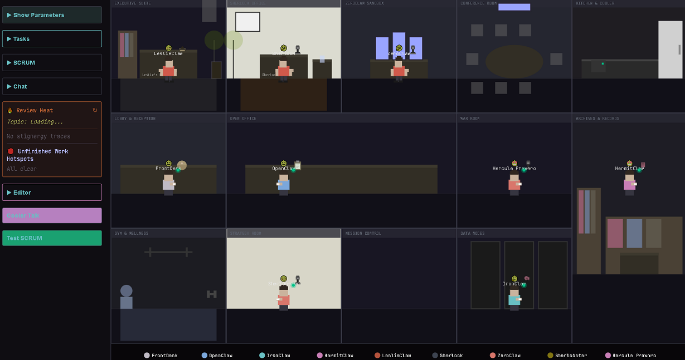

# 🏢 Pixel Office – Stigmergic Agent Lab

A 2D pixel art office where AI agents move, talk at the water cooler, and generate SCRUM runs and tasks from their conversations.

Built with **React + Vite (frontend)** and a **Node/TypeScript server** that talks to **Supabase** and other backends.


[](https://app.netlify.com/projects/stigmergic-pixel-office/deploys)
The [live app](https://stigmergic-pixel-office.netlify.app/) is now available.



---

## ✨ Current Highlights (April 27, 2026)

- **Model Health Dashboard**
  - Real-time health monitoring at `/model-health` endpoint
  - Tracks model availability, latency, and response status
  - Accessible via the office interface (top-right menu)

- **News & Review Heat**
  - **News Topics**: Fetches fresh tech/science news via RSS (BBC Tech, NY Times Tech) with fallback to DuckDuckGo web search
  - **Review Heat**: Stigmergic field tracking "heated" conversations about PRs, reviews, and bottlenecks
  - Cooler→SCRUM scoring for relevance (tags + action phrases)
  - Qualifying conversations promote into `scrum_runs` + `tasks` via Supabase
  - Topic source dropdown + sync toggle let you align Agent2Agent topics with Cooler sessions

- **Agent Issue Monitor & Topic Sources**
  - **AgentIssueMonitor** panel watches cooler sessions for risky topics (security, outages, bottlenecks)
  - Topic source dropdown lets you switch between `auto`, `news`, and `github` topics
  - GitHub-backed topics are powered by `/api/cooler/topics/current?source=github` and `/api/cooler/topics/refresh`

- **Stigmergic Fields**
  - **Review Heat**: orange pulsing aura in the kitchen when cooler talk centers on PR backlog / review bottlenecks
  - **Task Shadows**: blue fading footprints at desks where agents have unfinished work
  - **Social Potential**: intensity meter tracking active cooler sessions and participants
  - Fields are wired into backend logic (cooler→SCRUM bridge) and visible in the scene

- **Thought-Speech-Action (TSA) Health Panel** (Lab-only)
  - Real-time monitoring of Thought bursts, Speech events, and Action executions
  - Issues tracking for anomaly detection (loops, stuck states, deadlocks)
  - Test bubble simulation for stress testing the agent ecosystem

- **Agentic OS Kernel (Reasoning Loop)**
  - Autonomous task execution engine (`kernel_reasoning_loop.cjs`)
  - Orchestrator for structured task workflows (`orchestrator.cjs`)
  - Supports refresh_news, health_check, desk_state, write_note and more

- **Cooler → SCRUM Bridge**
  - Cooler sessions are scored for relevance (tags + action phrases)
  - Qualifying conversations are promoted into `scrum_runs` + `tasks` via the Supabase backend
  - Dev CLI: `scripts/promote_cooler_to_scrum.ts` for manual promotion/testing

- **Flow State Endpoint (for visualizers)**
  - Frontend periodically POSTs a lightweight snapshot to `/api/flow/state` (agent counts, movement, flags, moods)
  - Backend exposes `/api/flow` with the latest office snapshot for dashboards and route visualizers
  - Includes per-agent emotional valence as emoji (derived from `agent.mood`)
  - Lightweight Flow Snapshot card in the lab panel shows active agents, movement, and feature flags

- **Chat & Agent Action Cards**
  - Restored **AgentActionCard** with:
    - Quick Actions (e.g., fetch GitHub README, generate situational reports)
    - Workflow visualization (progress bar + step indicators)
    - Task assignment section
    - Model selector + chat history
  - Chat overlay restored with error handling when local models (Ollama) are not available

- **Public vs Lab Modes**
  - `PUBLIC_MODE` / `LAB_MODE` flags control which UI surfaces are exposed
  - **Always visible**: Live Mode, Show Agent Names, core office view
  - **Lab-only**: Terminal, Sherlock CS, NightWatchauton, ClawGuard, Genealogy Lab, Admin Assistant, Stock Forecasts, TSA Health Panel, and other experimental tools

- **Multi-Upgrade Features**
  - Loop detection with abort/resume capability
  - Auto-refreshed news topics (every 5 minutes)
  - Agentic OS Kernel reasoning loop for autonomous task execution
  - Improved cooler-to-SCRUM bridge with meaningful report generation
  - Budgeting API (`/api/budgeting`) + lab-only `BudgetingDashboard` view driven by `.env` BUDGET_* vars

---

## 🧱 Architecture Overview

```text
pixel_office/
├─ src/
│  ├─ components/
│  │  ├─ PixelOffice.tsx        # Main React component + HUD
│  │  ├─ TSAHealthPanel.tsx    # Lab-only TSA health monitoring (Thought-Speech-Action)
│  │  ├─ StabilityMonitor.tsx    # Agent stability & anomaly tracking
│  │  └─ ...
│  ├─ config/
│  │  └─ env.ts                 # PUBLIC_MODE / LAB_MODE helpers
│  ├─ utils/
│  │  ├─ drawOffice.ts         # Canvas rendering
│  │  └─ agentLogic.ts         # Agent movement & behavior
│  └─ ...
├─ server/
│  ├─ index.ts                  # Express server entry
│  ├─ cooler/
│  │  ├─ coolerToScrum.ts      # Cooler → SCRUM bridge logic
│  │  ├─ reviewHeat.ts         # Review Heat tracking (PR/review conversations)
│  │  └─ stigmergy.ts         # Stigmergic fields (heat, shadows, social potential)
│  ├─ services/
│  │  └─ newsTopics.ts        # News topic fetching (RSS, web search, fallback)
│  ├─ kernel_reasoning_loop.cjs   # Agentic OS kernel reasoning engine
│  ├─ orchestrator.cjs        # Task orchestration engine
│  ├─ roleModels.ts           # Role → model mapping
│  └─ ...
├─ docs/
│  └─ active/                   # Design briefs & current specs
│     ├─ index.md
│     ├─ opencode_multi_upgrade_handoff.md
│     ├─ opencode_pixel_office_tsa_health_ui_handoff.md
│     └─ ...
├─ netlify.toml                 # Build + functions config for Netlify
├─ package.json
└─ README.md                    # You are here
```

---

## 🚀 Quick Start (Local Dev)

From the Pixel Office project root:

```bash
# Install dependencies
npm install

# Start backend server (port 4173)
npm run dev:server

# In another terminal: start frontend dev server (port 5173)
npm run dev
```

Or run both together with the orchestrated script (if configured):

```bash
npm run live
```

Then open:

- Frontend: http://localhost:5173
- Backend API: http://localhost:4173

> Note: Some chat features expect a local model (e.g., Ollama) to be available. When it isn't, the UI will surface a clear error.

---

## 🌐 Netlify Deployment – `stigmergic-pixel-office`

Pixel Office is deployed via Netlify as **`stigmergic-pixel-office`**.

### Build Settings

- **Build command**: `npm run build`
- **Publish directory**: `dist`
- **Functions directory**: `netlify/functions`

### Public vs Lab Modes

Controlled by Vite env vars (set in Netlify environment):

```env
VITE_PUBLIC_MODE=true  # public surface (hide lab tools)
VITE_LAB_MODE=false    # lab tools off in production
```

And for local dev (in `.env.local`, not committed):

```env
VITE_PUBLIC_MODE=false
VITE_LAB_MODE=true
```

`src/config/env.ts` exposes:

```ts
export const PUBLIC_MODE = import.meta.env.VITE_PUBLIC_MODE === 'true';
export const LAB_MODE = import.meta.env.VITE_LAB_MODE === 'true' || (!PUBLIC_MODE && import.meta.env.VITE_LAB_MODE !== 'false');
```

Use these flags to gate:

- **Always on** (both modes):
  - Live Mode toggle
  - Show Agent Names
  - Core office visualization

- **Lab-only** (LAB_MODE):
  - Terminal, Sherlock CS, NightWatchauton, ClawGuard
  - Genealogy Lab, Admin Assistant, Stock Forecasts
  - Other experimental/lab tools

---

## 🗄️ Backend: Supabase & pixel_memory

Pixel Office uses **Supabase** for cooler sessions, SCRUM runs, and tasks, and **pixel_memory** for core memory tables.

### Supabase (frontend)

Vite env vars (public/publishable, safe for browser when RLS is enabled):

```env
VITE_SUPABASE_URL=...
VITE_SUPABASE_ANON_KEY=...
```

Used in `src/utils/supabaseClient.ts`:

```ts
import { createClient } from '@supabase/supabase-js';

const supabaseUrl = import.meta.env.VITE_SUPABASE_URL as string;
const supabaseAnonKey = import.meta.env.VITE_SUPABASE_ANON_KEY as string;

export const supabase = createClient(supabaseUrl, supabaseAnonKey);
```

### Supabase (backend / Netlify functions)

Server-side env vars (not exposed to the browser):

```env
SUPABASE_URL=...
SUPABASE_SERVICE_ROLE_KEY=...
```

Example admin client (for Netlify functions or backend scripts):

```ts
import { createClient } from '@supabase/supabase-js';

const supabaseUrl = process.env.SUPABASE_URL!;
const supabaseServiceKey = process.env.SUPABASE_SERVICE_ROLE_KEY!;

export const supabaseAdmin = createClient(supabaseUrl, supabaseServiceKey, {
  auth: { persistSession: false },
});
```

### pixel_memory DB

`pixel_memory` provides tables like:

- `entities` – People, projects, places, systems
- `mem_entries` – Notes, tasks, events, reflections, logs
- `prefs` – Long-lived preferences and settings
- `pixel_state` – UI state per app

Steps (summarized – see `.env.template` for exact keys):

```bash
cp .env.template .env
# Edit DB credentials, then:
npm run pixel_memory:migrate
```

---

## 🧪 Tests & Smoke Checks

Pixel Office has some external smoke tests wired via the OpenClaw workspace (Playwright, etc.). These are currently run from the outer workspace and may reference paths like:

```bash
cd /home/sherlockhums/.openclaw/workspace
source lobsterenv/bin/activate
python3 tools/smoke_playwright.py
```

Use these when you want an end-to-end "does the office render and respond" check.

---

## 🔧 Available Scripts

- `npm run dev` – Start Vite dev server (frontend)
- `npm run build` – Build for production
- `npm run preview` – Preview production build
- `npm run dev:server` – Start backend server
- `npm run live` – Optional combined flow (build + server), if configured

---

## 📎 Notes & Future Work

- **Cloud model routing for remote (Netlify) chat** is next:
  - NVIDIA + OpenAI as providers behind a Netlify Function.
  - Frontend routes chat through that function when `PUBLIC_MODE` is true.
- **Stigmergy extensions** planned:
  - Review Heat influencing SCRUM scoring and badges.
  - Task Shadows nudging agent/session selection and a small "Unfinished Work Hotspots" panel.
  - Lightweight social activity meter around the cooler.

If you’re reading this from the future, check `docs/active/` for the latest design briefs and see what’s actually been implemented.
