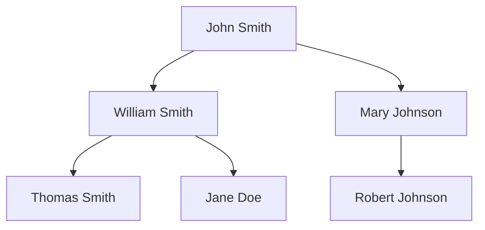

# Criminology Genealogy Lab - Upgrade Documentation

**Date:** February 15, 2026  
**Project:** Pixel Office

## Overview

Added a new **Criminology Genealogy Lab** module to the pixel_office project. This feature allows users to:
1. Input genealogy trees using Mermaid.js diagrams
2. Parse and visualize family trees
3. Automatically research each root branch via web search
4. Get recommendations on the easiest branch to research

---

## New Files Created

### 1. `server/genealogy.ts`
Server-side module handling genealogy parsing and research.

**API Endpoints:**
- `POST /api/genealogy/parse` - Parse Mermaid.js diagram
  - Body: `{ mermaid: string }`
  - Returns: `{ success, tree, branches, rootCount }`
  
- `POST /api/genealogy/research` - Research branches via web search
  - Body: `{ branchIds: string[] }` (optional, defaults to all roots)
  - Returns: `{ success, results, recommended }`
  
- `GET /api/genealogy/results` - Get current research state
  - Returns: `{ tree, results, isResearching }`

### 2. `src/components/GenealogyLab.tsx`
React component with three tabs:

| Tab | Description |
|-----|-------------|
| **Input** | Edit Mermaid.js genealogy diagram |
| **Tree** | Visual rendering of the family tree |
| **Results** | Research analysis with recommendations |

### 3. Modified Files

- `server/index.ts` - Added genealogy router mount
- `src/App.tsx` - Added view routing
- `src/components/PixelOffice.tsx` - Added navigation button to Parameters panel
- `package.json` - Added mermaid dependency

---

## Usage Instructions

### Starting the Server

```bash
cd ~/.openclaw/workspace/tasks/pixel_office
npm run live
```

This runs on port 4173 by default.

### Accessing the Genealogy Lab

1. Open Pixel Office at `http://localhost:4173`
2. Click "▶ Show Parameters" button
3. Click "🕵️ Genealogy Lab ↗" button

### Inputting a Genealogy Tree

Use Mermaid.js flowchart syntax:



Supported syntax:
- `A[Name] --> B[Name]` - Basic nodes with labels
- `A --> B` - Simple edges
- Labels are extracted from `[]` brackets

### Running Research

1. Click **Parse Tree** to analyze the genealogy
2. Select which branches to research (or all)
3. Click **Run Branch Analysis**
4. View results ranked by research difficulty

### Understanding Results

- **Easy**: Good online record availability (census, vital records, genealogy databases)
- **Medium**: Moderate difficulty, some online presence
- **Hard**: Limited online presence, may require archival research

The recommended branch is highlighted at the top.

---

## Technical Details

### Branch Analysis Algorithm

1. **Parse**: Extract nodes and parent-child relationships from Mermaid
2. **Identify Roots**: Find nodes with no parents
3. **Calculate Metrics**: Size (descendant count), depth (generations)
4. **Research**: Web search each branch for genealogical records
5. **Rank**: Sort by ease of research (records availability, Wikipedia presence)

### Web Search Integration

Uses DuckDuckGo API for research queries:
- Searches for genealogy, family records, archives
- Checks for census, vital records, FamilySearch, Ancestry, Wikipedia
- Returns sources and recommendations

---

## Dependencies Added

```json
"mermaid": "^11.0.0"
```

Mermaid.js is loaded dynamically in the component for tree visualization.

---

## Notes

- The genealogy lab runs as a SPA view within Pixel Office (no separate port)
- Research is performed sequentially to avoid rate limiting
- Results are sorted by difficulty (easiest first)
- All research is performed server-side
